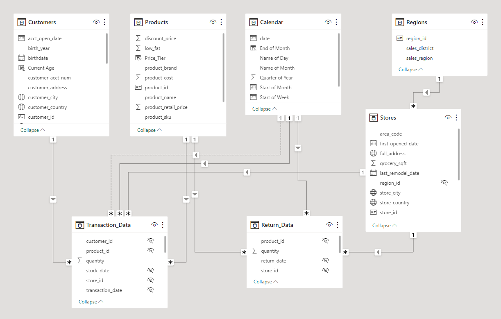
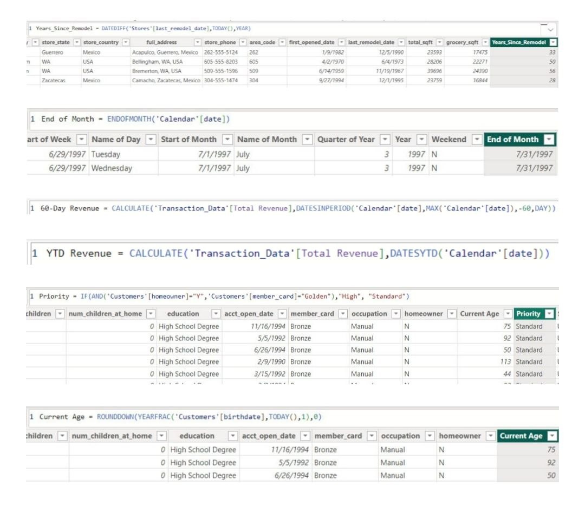
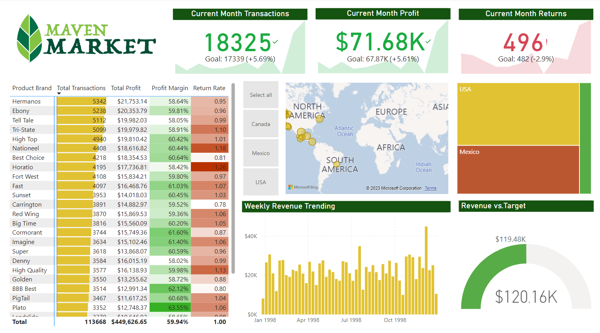

# MavenMarket Analytics

## Tools used: Power BI, Power Query, DAX

This is the final project from the 'Microsoft Power BI Desktop for Business Intelligence' course. I went through the whole business intelligence workflow, from connecting and preprocessing data to creating a data model and building an interactive dashboard.

Eight CSV files were used for the project. Although the datasets were relatively clean and complete, I performed some wrangling to obtain more insights. The steps included:
* Merging 'first_name' and 'last_name' columns, separated by a space, to create a 'full_name' column
* Extracting year from 'birthdate' column
* Creating a conditional column 'has_children' which equals 'N' if 'total_children' = 0 and 'Y' otherwise
* Using statistics tools to return number of distinct product brands (111) and distinct product names (1560)
* Adding calculated column 'discount_price', equal to 90% of original retail price, formatted as fixed decimal number and rounded to two digits
* Replacing "null" values with zeros in 'recyclable' and 'low-fat' columns
* Adding calculated column 'area_code' by extracting characters before the dash in 'store_phone' field
* Using date tools in query editor to add the following columns: Start of Week, Name of Day, Start of Month, Name of Month, Quarter of Year, and Year

The data model created is shown below. The two data tables are connected to the lookup tables but not to each other. All relationships follow a one-to-many cardinality, with primary keys on the lookup side and foreign keys on the data side. Filters are all one-way, and the filter context flows downstream from lookup tables to data tables.

Next, I created DAX measures in preparation for data visualisation. The measures include:
* 'Years_Since_Remodel' which calculates number of years between current date and last remodel date
* 'End of Month' which returns last date of current month for each row
* '60-Day Revenue' which calculates a running revenue total over a 60-day period
* 'YTD Revenue' which calculates year-to-date total revenue
* 'Priority' which equals 'High' for customers who own homes and have Golden membership cards (otherwise 'Standard')
* 'Current Age' which calculates current customer ages using 'birthdate' column

Finally, I created the dashboard. The features of the dashboard include (i) a matrix showing top 30 brands with data bars and conditional formatting, (ii) KPI cards, (iii) a map with country slicer, (iv) a treemap with drill down function, (v) a column chart to show the weekly revenue trend, and (vi) a gauge chart to compare the total revenue against the target revenue.

Insights:
* From the previous month, Maven Market had improved by 5.69% in the number of transactions and by 5.61% in profit. The top three brands by total number of transactions were Hermanos, Ebony, and Tell Tale. Plato, BBB Best, and Cormorant had performed well in terms of profit margin. Despite being a better performer in number of transactions, Tell Tale had the second lower profit margin.
* Drilling into the regions, the total transactions, profit, and returns in USA and Canada had decreased. The opposite was the case for Mexico.
* Although the number of transactions had increased overall, the overall number of returns had increased slightly by 2.9%. The three brands with the highest return rates are Horatio, Nationeel, and High Quality.
* The total revenue met the target revenue. However, USA and Canada did not meet their respective targets; only Mexico met its target.
* Thus, while Maven Market had increased its number of transactions, attention must be brought to the increased number of returns. It would be meaningful to look into the brands with the highest rates of return. There is also space for USA and Canada to grow in terms of revenue.
